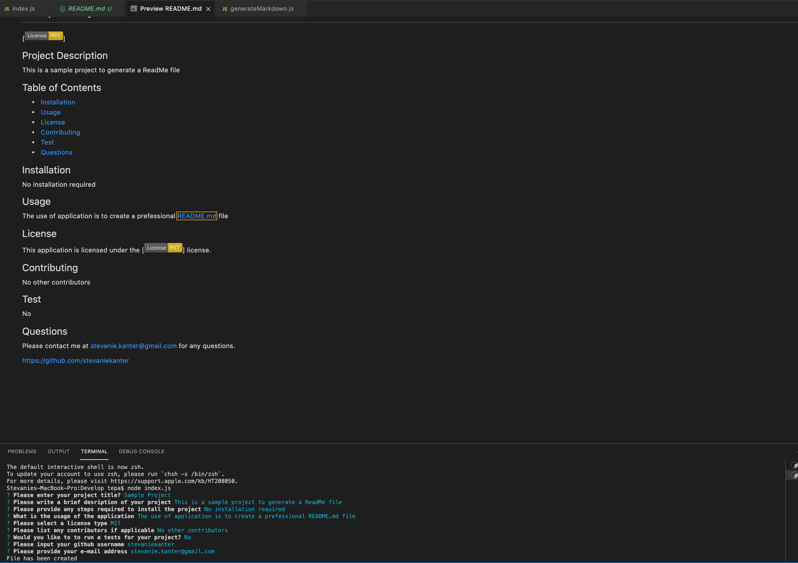

# README-Generator
Professional README Generator (Homework 9)

In this project, I have created a command-line application that will generate a professioal README.md file from a series of user input. This will help user save time and quickly create a README file. 

# Video Tutotial

Link: https://drive.google.com/file/d/1s6xNyTmS8TOAJgLRrKT4olKN2aXDEd46/view?usp=sharing

# Screenshot 

Screenshot of the generated README file as well as the command line response 

